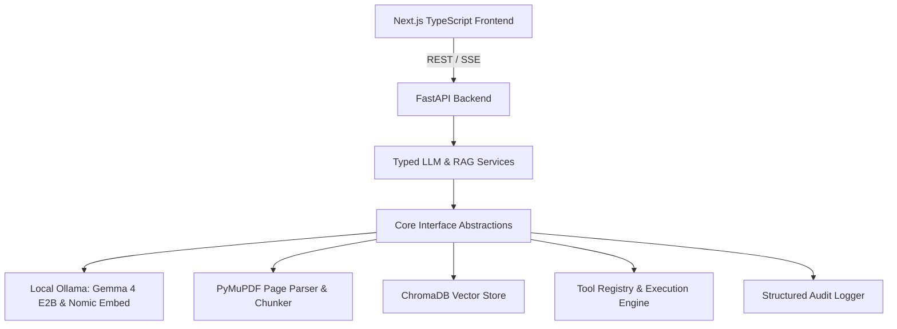

# Technology Stack & Architecture

This document provides a comprehensive overview of the technologies, libraries, frameworks, and architecture patterns powering **Sovereign-Core**.

---

## 1. Core Architecture Overview

Sovereign-Core is architected as an air-gapped, privacy-first AI platform that decouples interface contracts from underlying provider implementations.

---

## 2. Backend Technologies

| Technology | Version / Spec | Purpose & Role |
| :--- | :--- | :--- |
| **Python** | `3.11+` | Primary backend language utilizing modern async/await patterns and type annotations. |
| **FastAPI** | `^0.115.0` | High-performance asynchronous REST API framework providing automatic OpenAPI / Swagger documentation, dependency injection, and streaming response support. |
| **Uvicorn** | `^0.32.0` | Lightning-fast ASGI web server implementation for Python. |
| **Pydantic** | `^2.9.0` | Data validation, settings management (`pydantic-settings`), and strict schema serialization across all API contracts and tool definitions. |
| **HTTPX** | `^0.27.0` | Fully asynchronous HTTP client for non-blocking communication with the local Ollama daemon and external APIs with fine-grained timeout controls. |
| **PyMuPDF** | `^1.24.0` | High-performance PDF parser used for page-by-page text and layout extraction, retaining exact page coordinates and metadata. |
| **python-docx** | `^1.2.0` | Local Word document creation engine for structured, evidence-grounded approval notes and governance sign-off documents. |
| **ChromaDB** | `^0.5.0` | Local persistent embedding database using SQLite/DuckDB storage and HNSW cosine distance space for vector indexing and semantic nearest-neighbor retrieval. |
| **WebSockets** | Built-in FastAPI | Real-time bi-directional telemetry streaming for the AI Flight Recorder blackbox feed. |
| **Pytest** | `^8.3.0` | Test runner powering the unit, integration, and contract test suite (`pytest-asyncio`, `anyio`, `pytest-cov`). |

---

## 3. Local AI & LLM Models

| Component | Default Model / Engine | Purpose |
| :--- | :--- | :--- |
| **Ollama** | Daemon (`http://localhost:11434`) | Local execution engine for quantized GGUF models running natively on GPU/CPU without cloud telemetry. |
| **Default Chat LLM** | `gemma4:e2b` | Default lightweight, high-reasoning local foundation model by Google DeepMind. |
| **Alternative LLM** | `gemma4:e4b-it-qat` | Quantized instruct model for advanced local reasoning. |
| **Embedding Model** | `nomic-embed-text:latest` | 768-dimensional neural vector embedding model tuned for retrieval tasks and cosine similarity indexing. |
| **Deterministic Fallback** | `SimpleEmbeddingProvider` | Built-in zero-dependency vector provider used during offline development or testing. |

---

## 4. Controlled Agent & Tool Safety Boundaries

| Tool / Component | Type | Constraints & Guarantees |
| :--- | :--- | :--- |
| **InspectionAnalysisAgent** | Controlled ReAct Agent | Bounded by a strict step budget (1 to 10 steps). Evaluates goals using only registered inspection tools. |
| **ControlledToolRegistry** | Security Sandbox | Whitelists only permitted tools. Rejects unwhitelisted registration or execution attempts with security policy violations. |
| `document_retrieval` | Authorized Tool | Semantic nearest-neighbor retrieval from local ChromaDB vector store. Retains document names and page numbers. |
| `calculator` | Authorized Tool | Deterministic, safe mathematical operations (add, subtract, multiply, divide). |
| `document_generation` | Authorized Tool | Structured inspection report and Markdown generator with citations and recommendations. |
| `approval_note_generator` | Authorized Tool | Structured Approval Note and DOCX generator with claim-evidence validation, anti-hallucination warnings, and explicit human sign-off block. |
| **Flight Recorder Engine** | Blackbox Telemetry | Captures task ID, model, steps, tools called, retrieved sources, latency, errors, cryptographic SHA-256 artifacts, approval status, and network mode. |
| **Shell Access** | Prohibited | Strictly disabled. No bash, terminal, subprocess, or shell execution capability. |
| **Autonomous Internet** | Prohibited | Strictly disabled. No outbound HTTP crawling, external API requests, or autonomous web access. |

---

## 5. Frontend Technologies

| Technology | Version / Spec | Purpose & Role |
| :--- | :--- | :--- |
| **Next.js** | `^16.3.4` | Production React framework utilizing App Router, Server Components, and Turbopack bundler. |
| **React** | `^18.3.1` | Declarative UI library for building reactive client interfaces. |
| **TypeScript** | `^5.6.3` | Static type safety end-to-end matching backend Pydantic schemas. |
| **Lucide React** | `^0.454.0` | Clean, modern iconography across all workbench dashboards. |
| **Flight Recorder UI** | Custom Dashboard | Functional, evidence-oriented blackbox forensic UI with WebSocket streaming, latency ticker, and multi-pane evidence grid. |
| **Modern Styling** | Vanilla CSS Tokens | Sleek dark-mode aesthetic with CSS variables, glowing indicators, responsive grid layouts, and micro-interactions. |

---

## 6. Storage & Persistence

| Store | Location | Purpose |
| :--- | :--- | :--- |
| **ChromaDB Vector Store** | `./backend/data/chroma` | Persistent vector index holding chunk embeddings, document provenance, and page metadata. |
| **Flight Records** | `./backend/data/flight_records/` | Persistent JSON mission records for blackbox audit and replay. |
| **Generated Artifacts** | `./backend/data/artifacts/` | Generated local `.docx` approval notes and documents with SHA-256 integrity checksums. |
| **Audit Logs** | `./backend/data/audit.jsonl` | Append-only structured JSONL audit stream recording token usage, latencies, model parameters, and safety events. |
| **In-Memory Cache** | Process memory | High-speed cache for session diagnostics, active tools, and ephemeral streaming states. |

---

## 7. Containerization & DevOps

| Tool | Purpose |
| :--- | :--- |
| **Docker** | Multi-stage production container builds for frontend and backend. |
| **Docker Compose** | Multi-container local orchestration with host-gateway bridging (`host.docker.internal`) to allow containers to access host GPU-accelerated Ollama. |
