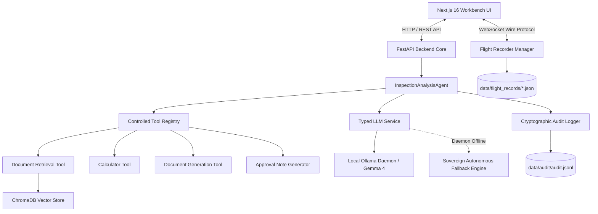
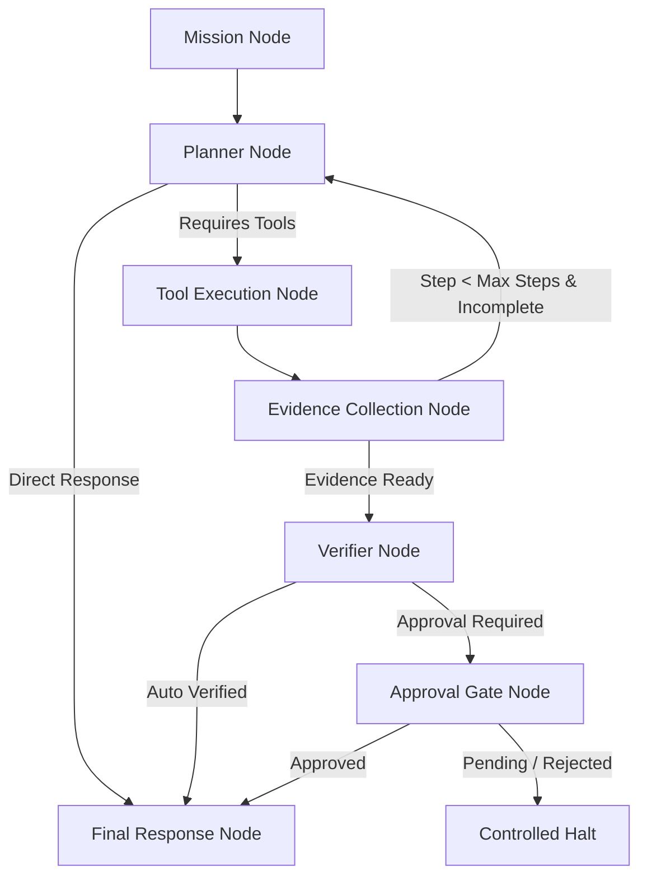

# Sovereign-Core Architecture Document

## 1. System Overview

**Sovereign-Core** is an air-gapped, privacy-first AI workbench and autonomous inspection engine designed for high-security enterprise environments. It provides local neural inference, dense vector document retrieval (RAG), strictly controlled tool registries, cryptographic audit logging, and an **AI Flight Recorder** black box for real-time telemetry streaming.



---

## 2. Core Architectural Principles

1. **Air-Gapped by Design**: All inference, vector search, telemetry processing, and artifact generation occur on the local machine without outbound network egress.
2. **Controlled Tool Boundaries**: Agents execute tools strictly via an authorized whitelist (`ControlledToolRegistry`). Unrestricted shell access, command execution, and arbitrary external network requests are strictly forbidden.
3. **Forensic Traceability (Black Box)**: Every agent thought, tool call, observed output, source citation, and error is recorded in immutable, timestamped flight records.
4. **Human-in-the-Loop Governance**: Automated agents cannot self-certify high-risk operations. Every inspection mission requires explicit approval workflows with generated DOCX audit artifacts.
5. **High Resilience**: Offline fallback engine guarantees uninterrupted system operation and diagnostic telemetry even when the local LLM daemon is offline.

---

## 3. Component Details

### 3.1 Backend Core (`/backend`)
- **FastAPI Framework**: Serves RESTful endpoints (`/api/v1`) and real-time WebSockets (`/api/v1/flight-recorder/ws`).
- **`InspectionAnalysisAgent`**: Bounded agent orchestrator enforcing maximum step counts, argument parsing, security violation logging, and live telemetry callbacks.
- **`FlightRecorderManager`**: Handles real-time client WebSocket subscriptions, mission orchestration, and disk persistence of mission records.
- **`ControlledToolRegistry`**: Validates tool invocation schemas and rejects unauthorized tool executions.
- **`ChromaRetriever`**: Semantic document chunking and dense vector similarity search using ChromaDB.
- **`FileAndMemoryAuditLogger`**: Structured JSONL audit logging with SHA-256 integrity and event indexing.

### 3.2 Frontend Workbench (`/frontend`)
- **Next.js 16 (App Router & Turbopack)**: High-performance, dark-mode analytical workbench.
- **AI Flight Recorder Deck**: Mission control panel, reasoning step timeline, tool execution ledger, retrieved sources preview, artifact checksum viewer, and live WebSocket console.
- **Agent Inspector**: Session configuration, model selection, step control, and real-time event monitor.
- **Audit Viewer**: Filterable log table displaying audit event types, latencies, and security policy violations.

---

## 4. Controlled Graph-Based Agent Orchestration (LangGraph Adapter)

Sovereign-Core incorporates **LangGraph** strictly as an internal execution adapter rather than the foundational application architecture.

```text
Sovereign Agent Interface (BaseAgent)
        ↓
Agent Orchestrator (LangGraphAgentOrchestrator)
        ↓
LangGraph Adapter (ControlledStateGraph)
        ↓
State Graph (Mission -> Planner -> Tools -> Evidence -> Verifier -> Approval -> Final Response)
        ↓
Sovereign Tool Adapter (SovereignToolAdapter)
        ↓
Controlled Tool Registry
```

### 4.1 Why LangGraph is an Adapter, Not the Application Architecture

1. **Architectural Sovereignty**: The Sovereign-Core domain model (security policies, air-gapped guarantees, tool registries, cryptographic audit sinks, and Flight Recorder wire protocol) is completely independent of external framework abstractions.
2. **Zero Framework Leakage**: No LangGraph or LangChain types leak into the public REST API, WebSocket transport layer, frontend clients, or core interface contracts.
3. **Pluggable & Swappable Orchestration**: By implementing `BaseAgent` and `BaseIntegrationAdapter`, graph-based orchestration can be toggled via configuration (`ENABLE_LANGGRAPH=true`) or dispatched on a per-mission basis (`orchestrator="langgraph"`).
4. **Air-Gap & Safety Invariants**: Third-party framework defaults often introduce unrestricted tool environments, cloud-based telemetry callbacks, or recursive cycles. Sovereign-Core encapsulates LangGraph within hard execution boundaries:
   - **Step Budget**: Strictly bounded between `1 <= max_steps <= 10` with graceful forced termination.
   - **Tool Allowlist**: LangGraph can only invoke tools through `SovereignToolAdapter`, which enforces registry allowlisting, argument schemas, and the `NO_EGRESS` network policy.
   - **Provenance & Verification**: Every graph edge preserves provenance, tool outputs, and evidence records, enforcing human-in-the-loop verification gates before final response emission.

### 4.2 State Graph Pipeline Topology



### 4.3 Strongly Typed State Concept (`GraphAgentState`)

- `mission_id`: Unique identifier for forensic tracking.
- `task`: High-level operational directive.
- `messages`: Air-gapped message stream.
- `current_step` & `max_steps`: Strict step budget counters.
- `selected_model`: Local model designation (`gemma4:e2b`, etc.).
- `tool_calls` & `tool_results`: Captured invocations and validated outcomes.
- `evidence`: Verified fact extractions from tools and RAG.
- `citations`: Traceable document chunk identifiers.
- `provenance`: Cryptographic provenance dictionary with timestamp and SHA-256 signatures.
- `verification_status`: Status enum (`unverified`, `in_progress`, `verified`, `rejected`).
- `approval_required` & `approval_status`: Human-in-the-loop authority status.
- `errors`: Bounded list of non-fatal execution errors.
- `final_output`: Synthesized, verified response.

---

## 5. Network and Security Model

| Network Mode | Ingress Allowed | Egress Allowed | LLM Provider |
| :--- | :--- | :--- | :--- |
| `AIR_GAPPED_LOCAL` | `localhost:3000`, `localhost:8000` | None (Localhost only) | Local Ollama Daemon (`127.0.0.1:11434`) |
| `ISOLATED_CONTAINER` | Docker internal network | None | Internal container Ollama service |
| `OFFLINE_SIMULATION` | `localhost:3000`, `localhost:8000` | None | Sovereign Autonomous Fallback Engine |
