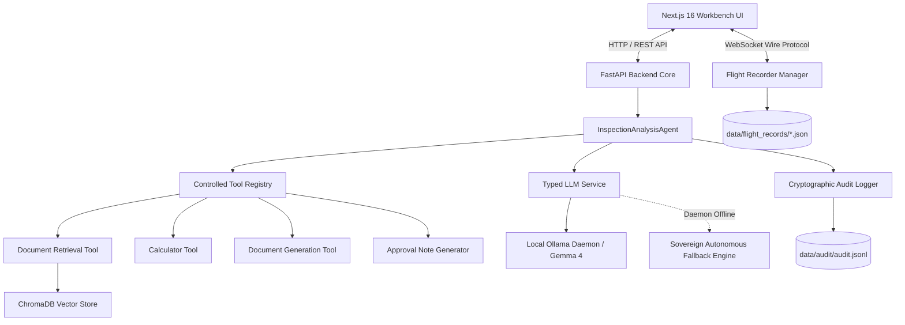

# Sovereign-Core Architecture Document

## 1. System Overview

**Sovereign-Core** is an air-gapped, privacy-first AI workbench and autonomous inspection engine designed for high-security enterprise environments. It provides local neural inference, dense vector document retrieval (RAG), strictly controlled tool registries, cryptographic audit logging, and an **AI Flight Recorder** black box for real-time telemetry streaming.

---

## 2. Core Architectural Principles

1. **Air-Gapped by Design**: All inference, vector search, telemetry processing, and artifact generation occur on the local machine without outbound network egress.
2. **Controlled Tool Boundaries**: Agents execute tools strictly via an authorized whitelist (`ControlledToolRegistry`). Unrestricted shell access, command execution, and arbitrary external network requests are strictly forbidden.
3. **Forensic Traceability (Black Box)**: Every agent thought, tool call, observed output, source citation, and error is recorded in immutable, timestamped flight records.
4. **Human-in-the-Loop Governance**: Automated agents cannot self-certify high-risk operations. Every inspection mission requires explicit approval workflows with generated DOCX audit artifacts.
5. **High Resilience**: Offline fallback engine guarantees uninterrupted system operation and diagnostic telemetry even when the local LLM daemon is offline.

---

## 3. Component Details

### 3.1 Backend Core (`/backend`)
- **FastAPI Framework**: Serves RESTful endpoints (`/api/v1`) and real-time WebSockets (`/api/v1/flight-recorder/ws`).
- **`InspectionAnalysisAgent`**: Bounded agent orchestrator enforcing maximum step counts, argument parsing, security violation logging, and live telemetry callbacks.
- **`FlightRecorderManager`**: Handles real-time client WebSocket subscriptions, mission orchestration, and disk persistence of mission records.
- **`ControlledToolRegistry`**: Validates tool invocation schemas and rejects unauthorized tool executions.
- **`ChromaRetriever`**: Semantic document chunking and dense vector similarity search using ChromaDB.
- **`FileAndMemoryAuditLogger`**: Structured JSONL audit logging with SHA-256 integrity and event indexing.

### 3.2 Frontend Workbench (`/frontend`)
- **Next.js 16 (App Router & Turbopack)**: High-performance, dark-mode analytical workbench.
- **AI Flight Recorder Deck**: Mission control panel, reasoning step timeline, tool execution ledger, retrieved sources preview, artifact checksum viewer, and live WebSocket console.
- **Agent Inspector**: Session configuration, model selection, step control, and real-time event monitor.
- **Audit Viewer**: Filterable log table displaying audit event types, latencies, and security policy violations.

---

## 4. Network and Security Model

| Network Mode | Ingress Allowed | Egress Allowed | LLM Provider |
| :--- | :--- | :--- | :--- |
| `AIR_GAPPED_LOCAL` | `localhost:3000`, `localhost:8000` | None (Localhost only) | Local Ollama Daemon (`127.0.0.1:11434`) |
| `ISOLATED_CONTAINER` | Docker internal network | None | Internal container Ollama service |
| `OFFLINE_SIMULATION` | `localhost:3000`, `localhost:8000` | None | Sovereign Autonomous Fallback Engine |
