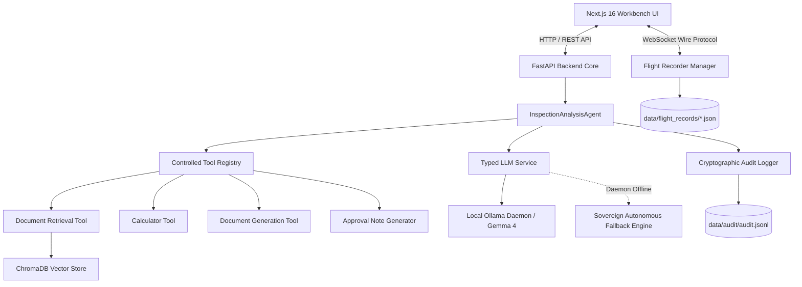
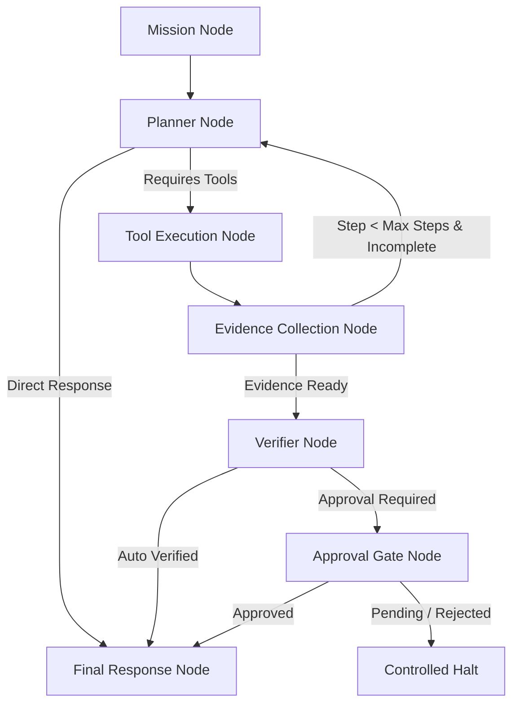

# Sovereign-Core Architecture Document

## 1. System Overview

**Sovereign-Core** is an air-gapped, privacy-first AI workbench and autonomous inspection engine designed for high-security enterprise environments. It provides local neural inference, dense vector document retrieval (RAG), strictly controlled tool registries, cryptographic audit logging, and an **AI Flight Recorder** black box for real-time telemetry streaming.



---

## 2. Core Architectural Principles

1. **Air-Gapped by Design**: All inference, vector search, telemetry processing, and artifact generation occur on the local machine without outbound network egress.
2. **Controlled Tool Boundaries**: Agents execute tools strictly via an authorized whitelist (`ControlledToolRegistry`). Unrestricted shell access, command execution, and arbitrary external network requests are strictly forbidden.
3. **Forensic Traceability (Black Box)**: Every agent thought, tool call, observed output, source citation, and error is recorded in immutable, timestamped flight records.
4. **Human-in-the-Loop Governance**: Automated agents cannot self-certify high-risk operations. Every inspection mission requires explicit approval workflows with generated DOCX audit artifacts.
5. **High Resilience**: Offline fallback engine guarantees uninterrupted system operation and diagnostic telemetry even when the local LLM daemon is offline.

---

## 3. Component Details

### 3.1 Backend Core (`/backend`)
- **FastAPI Framework**: Serves RESTful endpoints (`/api/v1`) and real-time WebSockets (`/api/v1/flight-recorder/ws`).
- **`InspectionAnalysisAgent`**: Bounded agent orchestrator enforcing maximum step counts, argument parsing, security violation logging, and live telemetry callbacks.
- **`FlightRecorderManager`**: Handles real-time client WebSocket subscriptions, mission orchestration, and disk persistence of mission records.
- **`ControlledToolRegistry`**: Validates tool invocation schemas and rejects unauthorized tool executions.
- **`ChromaRetriever`**: Semantic document chunking and dense vector similarity search using ChromaDB.
- **`FileAndMemoryAuditLogger`**: Structured JSONL audit logging with SHA-256 integrity and event indexing.

### 3.2 Frontend Workbench (`/frontend`)
- **Next.js 16 (App Router & Turbopack)**: High-performance, dark-mode analytical workbench.
- **AI Flight Recorder Deck**: Mission control panel, reasoning step timeline, tool execution ledger, retrieved sources preview, artifact checksum viewer, and live WebSocket console.
- **Agent Inspector**: Session configuration, model selection, step control, and real-time event monitor.
- **Audit Viewer**: Filterable log table displaying audit event types, latencies, and security policy violations.

---

## 4. Controlled Graph-Based Agent Orchestration (LangGraph Adapter)

Sovereign-Core incorporates **LangGraph** strictly as an internal execution adapter rather than the foundational application architecture.

```text
Sovereign Agent Interface (BaseAgent)
        ↓
Agent Orchestrator (LangGraphAgentOrchestrator)
        ↓
LangGraph Adapter (ControlledStateGraph)
        ↓
State Graph (Mission -> Planner -> Tools -> Evidence -> Verifier -> Approval -> Final Response)
        ↓
Sovereign Tool Adapter (SovereignToolAdapter)
        ↓
Controlled Tool Registry
```

### 4.1 Why LangGraph is an Adapter, Not the Application Architecture

1. **Architectural Sovereignty**: The Sovereign-Core domain model (security policies, air-gapped guarantees, tool registries, cryptographic audit sinks, and Flight Recorder wire protocol) is completely independent of external framework abstractions.
2. **Zero Framework Leakage**: No LangGraph or LangChain types leak into the public REST API, WebSocket transport layer, frontend clients, or core interface contracts.
3. **Pluggable & Swappable Orchestration**: By implementing `BaseAgent` and `BaseIntegrationAdapter`, graph-based orchestration can be toggled via configuration (`ENABLE_LANGGRAPH=true`) or dispatched on a per-mission basis (`orchestrator="langgraph"`).
4. **Air-Gap & Safety Invariants**: Third-party framework defaults often introduce unrestricted tool environments, cloud-based telemetry callbacks, or recursive cycles. Sovereign-Core encapsulates LangGraph within hard execution boundaries:
   - **Step Budget**: Strictly bounded between `1 <= max_steps <= 10` with graceful forced termination.
   - **Tool Allowlist**: LangGraph can only invoke tools through `SovereignToolAdapter`, which enforces registry allowlisting, argument schemas, and the `NO_EGRESS` network policy.
   - **Provenance & Verification**: Every graph edge preserves provenance, tool outputs, and evidence records, enforcing human-in-the-loop verification gates before final response emission.

### 4.2 State Graph Pipeline Topology



### 4.3 Strongly Typed State Concept (`GraphAgentState`)

- `mission_id`: Unique identifier for forensic tracking.
- `task`: High-level operational directive.
- `messages`: Air-gapped message stream.
- `current_step` & `max_steps`: Strict step budget counters.
- `selected_model`: Local model designation (`gemma4:e2b`, etc.).
- `tool_calls` & `tool_results`: Captured invocations and validated outcomes.
- `evidence`: Verified fact extractions from tools and RAG.
- `citations`: Traceable document chunk identifiers.
- `provenance`: Cryptographic provenance dictionary with timestamp and SHA-256 signatures.
- `verification_status`: Status enum (`unverified`, `in_progress`, `verified`, `rejected`).
- `approval_required` & `approval_status`: Human-in-the-loop authority status.
- `errors`: Bounded list of non-fatal execution errors.
- `final_output`: Synthesized, verified response.

---

## 5. Network and Security Model

| Network Mode | Ingress Allowed | Egress Allowed | LLM Provider |
| :--- | :--- | :--- | :--- |
| `AIR_GAPPED_LOCAL` | `localhost:3000`, `localhost:8000` | None (Localhost only) | Local Ollama Daemon (`127.0.0.1:11434`) |
| `ISOLATED_CONTAINER` | Docker internal network | None | Internal container Ollama service |
| `OFFLINE_SIMULATION` | `localhost:3000`, `localhost:8000` | None | Sovereign Autonomous Fallback Engine |

---

## 6. Standardized OpenTelemetry Distributed Tracing & Metrics

Sovereign-Core layers industry-standard **OpenTelemetry** beneath the mission-critical **AI Flight Recorder**, providing fine-grained observability, span correlation, and latency profiling while strictly maintaining local-first, air-gapped guarantees.

```text
Application Core
    │
    ├── Flight Recorder (User-facing forensic blackbox)
    │     ├── Immutable task ledger
    │     ├── Cryptographic audit verification
    │     └── Correlated trace_id & span_id
    │
    └── OpenTelemetry Subsystem (Internal observability engine)
          ├── Nested Spans (W3C TraceContext)
          ├── Metric Counters & Histograms
          ├── Automated Attribute Redaction Engine
          └── Local Exporters (in_memory, console, or local OTLP)
```

### 6.1 Trace Hierarchy & Spans

Traces map every subsystem execution down to atomic operations:

```text
mission (root)
 ├── planner / agent.execution
 ├── llm.call (model, latency, tokens, streaming)
 ├── rag.retrieve (collection, top_k, query)
 │    ├── embedding (model, chunk_count)
 │    └── vector.search (collection, top_k)
 ├── tool.{name} (calculator, document_retrieval, etc.)
 ├── verification (evidence_count, claim)
 ├── approval (mission_id, status)
 ├── artifact.generate (type, checksum)
 └── workflow.execution (workflow_id, steps)
```

### 6.2 Standardized Metrics

OpenTelemetry Instruments exported:
- `llm_requests_total`: Counter tracking completion and streaming invocations tagged by model and status.
- `llm_latency_seconds`: Histogram tracking response latency per model.
- `llm_errors_total`: Counter for timeouts, model-not-found, and server errors.
- `rag_queries_total` & `rag_latency_seconds`: Semantic vector search frequency and performance.
- `tool_calls_total`: Execution volume tagged by tool name.
- `agent_missions_total` & `agent_failures_total`: Agent success and failure rates.
- `workflow_executions_total` & `workflow_failures_total`: Directed workflow graph performance.

### 6.3 Security, Privacy & Air-Gap Telemetry Guarantees

1. **Local Exporters Only**: Telemetry default is `OTEL_ENABLED=false` or local `in_memory`/`console`. OTLP endpoints are validated via `validate_local_endpoint()` to reject non-localhost destinations.
2. **Automated Attribute Redaction**: Passwords, API keys, credentials, Bearer tokens, and sensitive headers are masked (`[REDACTED_CREDENTIAL]`). Full prompts and document text are truncated to 120 characters with explicit preview metadata (`[CONTENT_TRUNCATED]`).
3. **Flight Recorder Bridge**: The telemetry bridge attaches active `trace_id` and `span_id` to Flight Events, Step Records, and persisted Flight Records without altering Flight Recorder schemas.

---

## 7. Sovereign Workflow Engine & Dify Interoperability Layer

Sovereign-Core provides a deterministic, directed acyclic graph (DAG) workflow runtime governed by strict static security analysis and zero-egress enforcement. To support workflow portability across enterprise teams, it includes a bidirectional **Dify Interoperability Layer** that safely translates between Dify DSL definitions and Sovereign internal primitives.

```text
External Dify DSL (Untrusted YAML/JSON)
                 ↓
      Security Static Analyzer
    (AST Checks, Tool Allowlist,
     Cycle Detection, Step Capping)
                 ↓
      State: APPROVAL_REQUIRED
                 ↓
      Human Operator Sign-Off
                 ↓
         State: READY
                 ↓
   Sovereign Workflow Runtime (DAG)
(START → RAG → TOOL → LLM → APPROVAL → END)
                 ↓
    Flight Recorder Blackbox Sink
```

### 7.1 Internal Workflow Model

Sovereign-Core remains the authoritative system of record. External formats are normalized into typed internal Pydantic models:

- **`Workflow`**: Holds `id`, `name`, `version`, `state`, `nodes`, `edges`, `inputs`, `outputs`, and `policy`.
- **Node Types**:
  - `START`: Directive intake and context initialization.
  - `RAG`: Air-gapped dense vector retrieval from local ChromaDB.
  - `TOOL`: Sandboxed tool invocation via the `ControlledToolRegistry`.
  - `LLM`: Local inference synthesis via Ollama (`gemma4:e2b`).
  - `AGENT`: Autonomous multi-step LangGraph reasoning subsystem.
  - `CONDITION`: Deterministic branch evaluator.
  - `APPROVAL`: Mandatory operator review checkpoint.
  - `END`: Cryptographically sealed mission completion and provenance signature.
- **`WorkflowPolicy`**: Inherited execution bounds specifying `no_egress=True`, `max_steps` budget, tool allowlist, and memory/time constraints.

### 7.2 Static Security Analysis & Human-in-the-Loop Governance

Imported workflows are treated as untrusted input. The `WorkflowSecurityAnalyzer` applies multi-stage defense-in-depth:
1. **Topology Validation**: Detects illegal cycles via Kahn's algorithm; verifies at least one `START` and `END` node; flags disconnected nodes.
2. **Tool Sandboxing**: Rejects unallowlisted tools, shell commands, and raw network requests.
3. **AST Safety Filter**: Blocks dangerous imports (`os`, `sys`, `socket`, `subprocess`, `urllib`, `requests`) in code or expression configs.
4. **Credential Exfiltration Detection**: Scans for embedded API keys, tokens, or exfiltration paths.
5. **Human Gate**: Untrusted workflows import in `APPROVAL_REQUIRED` state and cannot execute until approved via `/api/v1/workflows/{id}/approve`.

---

## 8. Local-First Session Lifecycle & Dual-Tier State Persistence

To provide instant UI responsiveness without remote dependency or state loss, Sovereign-Core implements a dual-tier persistence model:

```text
Browser Client (Next.js 16)                     FastAPI Backend Core
 ┌───────────────────────────┐                  ┌────────────────────────┐
 │ SessionStore              │                  │ /api/v1/sessions       │
 │  ├── Memory Cache         │                  │  ├── Session File Store│
 │  ├── localStorage         │ <══ Sync API ══> │  │   (data/sessions/*. │
 │  └── CustomEvent EventBus │                  │  │    json)            │
 └───────────────────────────┘                  └────────────────────────┘
```

1. **Client-Side Reactive Store**: `sessionStore` maintains an in-memory cache synchronized with `localStorage` and publishes events via `CustomEvent('sovereign_session_change')`.
2. **Event Loop Recursion Guard**: State subscriptions separate local workspace updates (`switchSessionLocalState`) from store write operations (`handleSelectSession`), using mutable reference guards (`activeSessionIdRef`) to prevent infinite recursion.
3. **DOM Preservation Lifecycle**: Primary workbench navigation uses CSS display toggling (`display: none | block | flex`) rather than conditional component unmounting, keeping WebSockets, Three.js WebGL contexts, and unfinished prompts alive across tabs.
4. **Backend Disk Persistence**: The backend persists multi-turn session records and token consumption metrics to `data/sessions/`, with path traversal validation preventing unauthorized file access.

